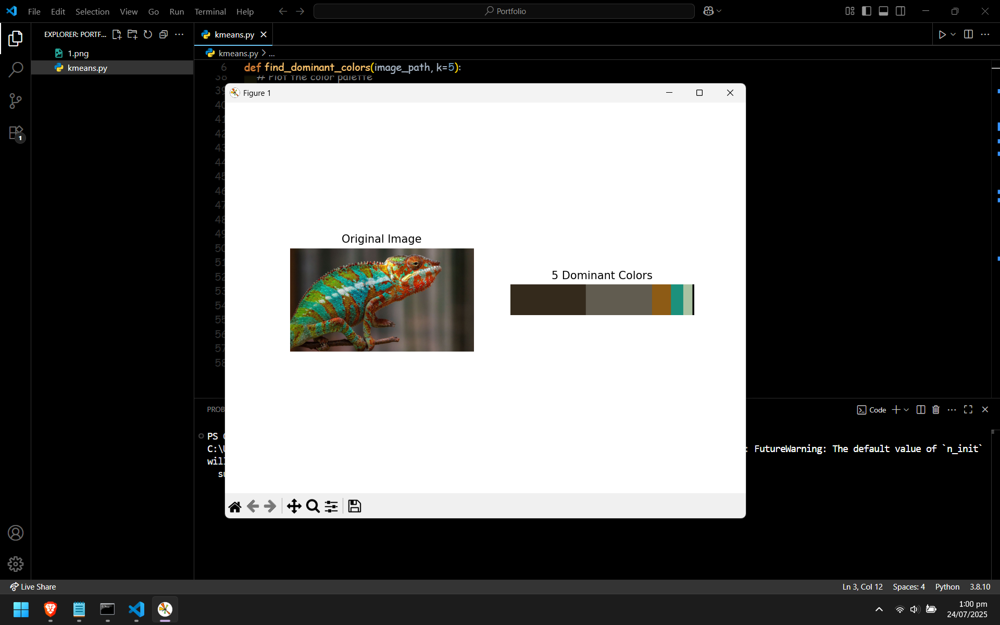

# 🎨 Dominant Color Detection using K-Means Clustering

> A Python-based tool to identify and visualize the **most dominant colors** in any image using the **K-Means clustering algorithm**. Perfect for color analysis, data visualization, and computer vision projects.

---

## 🧠 What is K-Means Clustering?

K-Means is an **unsupervised machine learning algorithm** used to partition data into `k` clusters. In this project, each pixel in the image is treated as a data point in RGB space. The algorithm finds `k` dominant colors that best represent the pixel distribution.

---

## 🎯 Features

✅ Detect top `k` dominant colors from any image  
✅ Display color palette as a visual bar  
✅ Sort colors by frequency in image  
✅ Lightweight and beginner-friendly  
✅ Modular and customizable Python code  

---

## 🛠️ Installation

### 🐍 Python Version
Make sure you're using **Python 3.8+**

### 📦 Install Dependencies

pip install opencv-python scikit-learn matplotlib numpy

---

## 📸 Output Preview

